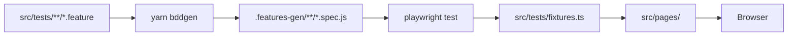
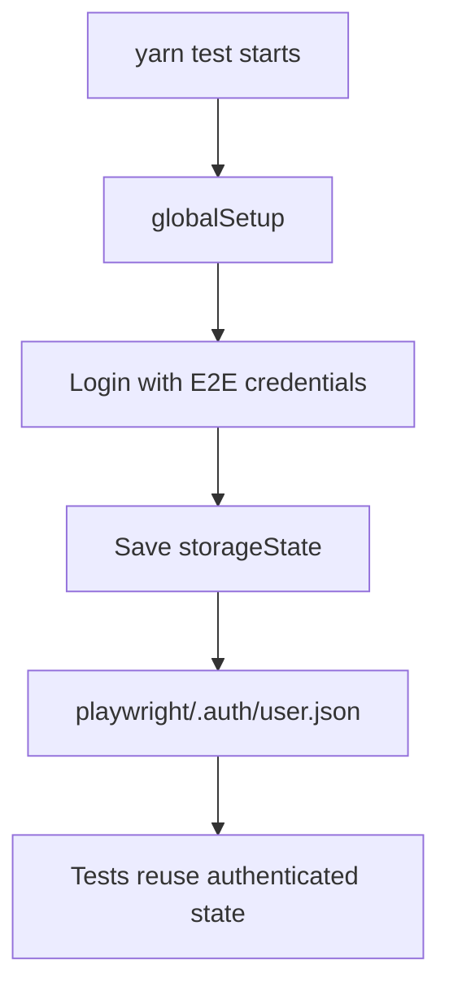

# APM E2E Playwright

End-to-end test suite for APM using **Playwright Test**, **playwright-bdd**, and **TypeScript**.

## Overview

This project uses BDD feature files with Playwright as the execution engine. Feature files and step definitions live by business domain, while UI interactions are isolated in page objects.

Core rules:

- Use Yarn for all commands.
- Use `playwright-bdd`; do not run raw Cucumber directly.
- Keep selectors and low-level UI actions in page objects.
- Keep step definitions focused on business flow.
- Put test data in domain support fixtures, builders, seeders, or mocks.
- Reuse authenticated Playwright `storageState` generated by global setup.

## Project Structure

```text
src/
  config/
    testConfig.ts
  hooks/
    global-setup.ts
    hooks.ts
  pages/
    shared/
      BasePage.ts
    approval-tier/
    authentication/
    cost-code/
    invoice-creation/
    invoice-inquiry/
    menu-bar/
    vendor-cost-description/
    work-order/
  support/
    shared/
    authentication/
    approval-tier/
    cost-code/
    vendor-cost-description/
    work-order/
  tests/
    fixtures.ts
    shared/
    approval-tier/
    cost-code/
    invoice-creation/
    invoice-inquiry/
    menu-bar/
    vendor-cost-description/
    work-order/
```

Generated and runtime folders:

```text
.features-gen/          generated by playwright-bdd
playwright/.auth/       generated auth storage state
reports/                Playwright HTML, JSON, JUnit, traces, screenshots
allure-results/         Allure raw result files
```

## Install

```bash
yarn install
yarn playwright install
```

## Environment

Create a local `.env` from the example file:

```bash
cp .env.example .env
```

Important variables:

```env
BASE_URL=https://chorus-test.one-line.com/
BROWSER=chromium
HEADLESS=true
ACTION_TIMEOUT=15000
NAVIGATION_TIMEOUT=30000
SCENARIO_TIMEOUT=60000
E2E_USER=
E2E_PASS=
```

Role-specific credentials are supported through `.env.example` variables such as:

```env
E2E_CREATOR_USER=
E2E_CREATOR_PASS=
E2E_SYSTEM_ADMIN_USER=
E2E_SYSTEM_ADMIN_PASS=
E2E_APPROVER_USER=
E2E_APPROVER_PASS=
```

## Commands

```bash
yarn bddgen
yarn typecheck
yarn lint
yarn format
```

Run tests:

```bash
yarn test
yarn test:chromium
yarn test:chromium:parallel
yarn test:parallel
yarn test:headed
yarn test:debug
```

Run by tag:

```bash
yarn test:tags -- '@cost-code'
yarn test:tags -- '@vendor-cost'
yarn test:tags -- '@approval-tier'
```

Reports:

```bash
yarn report
yarn allure:generate
yarn allure:open
```

Cleanup:

```bash
yarn clean
```

## BDD Flow



`playwright-bdd` reads feature files and step definitions, then generates Playwright specs. The generated specs are what Playwright executes.

## Authentication

Authentication is handled once in `src/hooks/global-setup.ts`.



Normal authenticated scenarios should rely on this shared state. Scenarios that intentionally test login behavior should use `@skip-auto-login`.

Role switching is centralized in:

```text
src/support/authentication/role-auth.ts
```

## Writing Tests

Feature and step files should stay in the same domain folder:

```text
src/tests/<domain>/<feature>.feature
src/tests/<domain>/<feature>.steps.ts
```

Steps should use fixtures from:

```text
src/tests/fixtures.ts
```

Example:

```ts
When('the user opens the Cost Code List screen', async ({ costCodeListPage }) => {
  await costCodeListPage.navigateToCostCodeList();
});
```

Do not instantiate page objects inside step files:

```ts
// Avoid
const pageObject = new CostCodeListPage(page);
```

## Page Objects

Page objects live under:

```text
src/pages/<domain>/
```

Use this shape:

```text
<Domain>Page.ts
<Domain>Selectors.ts
index.ts
```

Rules:

- Page objects extend `BasePage`.
- Locators and selector strings stay inside page objects/selectors.
- Steps call high-level methods such as `clickSearch()`, `selectRowByStatus(status)`, or `expectPageSettled()`.
- Use `BasePage` helpers for click/fill/wait behavior.
- Prefer locators in this order where practical: role, label, text, test id, CSS.

## Test Data

Domain data belongs under `src/support/<domain>`.

Examples:

```text
src/support/cost-code/fixtures/default-data.json
src/support/cost-code/test-data.ts
src/support/vendor-cost-description/fixtures/default-data.json
src/support/vendor-cost-description/test-data.ts
```

Use `FixtureLoader` for shared loading and caching:

```text
src/support/shared/lib/fixture-loader.ts
```

Do not add new inline data directly in `.feature` or `.steps.ts` files when the value can live in a fixture, builder, seeder, or mock.

## Verification Workflow

For source changes:

```bash
yarn format
yarn typecheck
yarn lint
yarn bddgen
```

For test changes, run the smallest useful tag first:

```bash
yarn test:tags -- '@your-tag'
```

Run full Chromium only after tagged validation is clean:

```bash
yarn test:chromium
```

Run parallel validation after Chromium is stable:

```bash
yarn test:chromium:parallel
```

## Reports and Artifacts

Playwright outputs are configured in `playwright.config.ts`.

Primary artifacts:

- HTML report: `reports/playwright-html-report`
- JSON report: `reports/test-results.json`
- JUnit report: `reports/junit-report.xml`
- Test artifacts: `reports/test-results`
- Allure results: `allure-results`

Open the Playwright report:

```bash
yarn report
```

## Notes

- Chromium is the current local execution project.
- Firefox and WebKit are not enabled in `playwright.config.ts`.
- Do not commit generated `.features-gen`, auth storage, reports, screenshots, videos, or Allure output.
