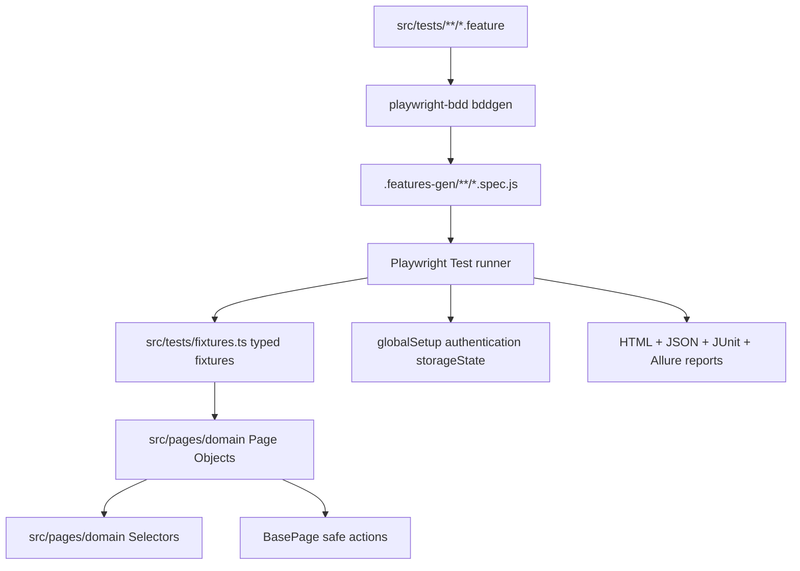
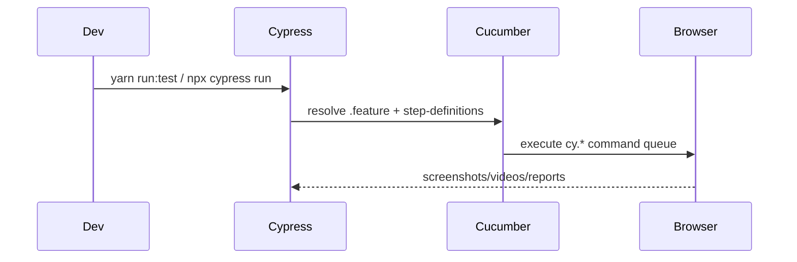
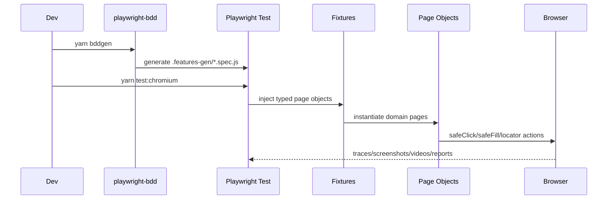
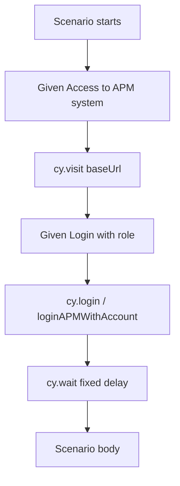
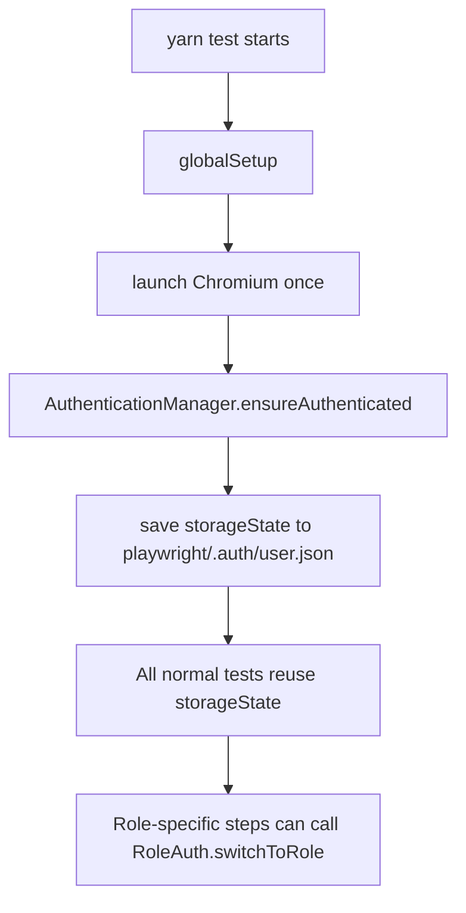
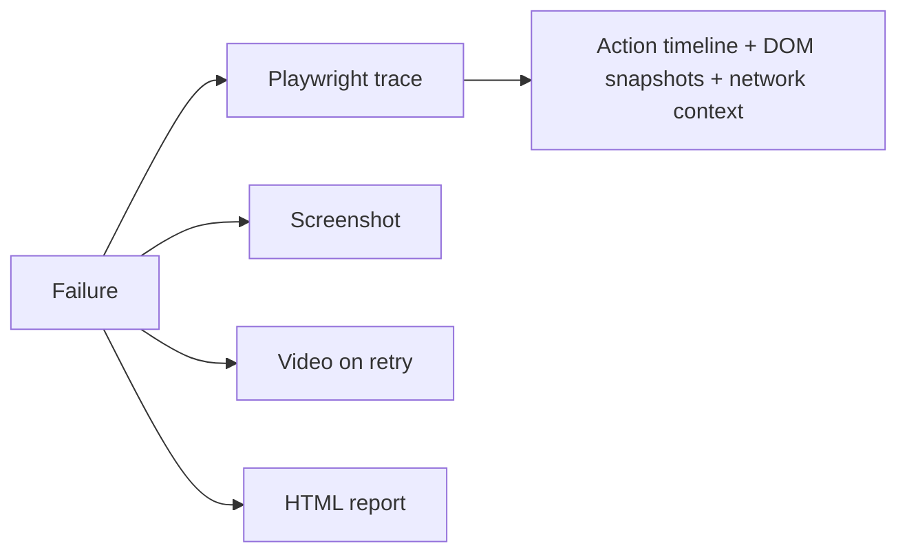
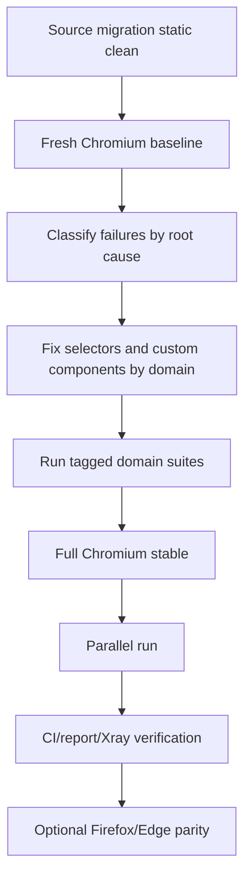

# Cypress to Playwright Migration Comparison

> Old source: `C:\Users\Public\ws\APM\om-apm-automation`  
> New source: `C:\Users\Public\ws\APM\om-apm-e2e-playwright`  
> Review date: 2026-05-12  
> Scope note: the old Cypress repository contains more modules than the selected executable migration scope. The current Playwright repo tracks the selected migrated scope in `docs/MIGRATION-PROGRESS.md`.

## Executive Summary

The migration changed the suite from a Cypress command-chain implementation to a Playwright Test + `playwright-bdd` implementation with typed fixtures, Page Object Model boundaries, centralized auth state, and domain support folders.

The biggest architectural changes are:

- Cypress `cy.*` commands in step utilities are replaced by Playwright page objects and injected fixtures.
- Runtime binding moved from Cypress Cucumber preprocessor to `playwright-bdd`, which generates Playwright spec files under `.features-gen`.
- Authentication moved from repeated scenario-level login helpers to a Playwright `globalSetup` that saves `storageState` once for reuse.
- Direct selector logic moved toward `src/pages/<domain>/*Page.ts` and `*Selectors.ts`.
- Test data started moving from inline values/hardcoded helpers into `src/support/<domain>/fixtures/default-data.json` and typed `test-data.ts` loaders.
- Command standard moved from mixed `npm` / `npx` / Yarn scripts to Yarn-only scripts.

Static migration health after the latest cleanup:

```text
yarn format       ✅ completed
yarn typecheck    ✅ 0 errors
yarn lint         ✅ 0 errors
yarn bddgen       ✅ generated cleanly
```

Runtime pass rate is intentionally not concluded here because the user explicitly deferred stale runtime failure fixing until the final recheck. Any speed or stability claim below is therefore separated into:

- **Implemented design advantage**: supported by source/config.
- **Not yet measured**: requires fresh `yarn test:chromium` and timing comparison.

## High-Level Architecture

### Before: Cypress + Cucumber Preprocessor

```mermaid
flowchart TD
  A[.feature files under cypress/e2e/features] --> B[@badeball/cypress-cucumber-preprocessor]
  B --> C[step-definitions/**/*.ts]
  C --> D[cy.* command chains]
  D --> E[Cypress browser runner]
  C --> F[cypress/support/commands.ts]
  C --> G[constants/utils mixed under step-definitions]
  E --> H[mochawesome + junit reports]
  E --> I[BrowserStack optional: Chrome, Firefox, Edge]
```

### After: Playwright Test + `playwright-bdd`



## Repository Structure Comparison

### Old Cypress Structure

The old repo is Cypress-native and has a broad tree under `cypress/`:

```text
om-apm-automation/
  cypress/
    e2e/
      features/
        APM/
        Code/
        pages/
        Setting/
        wo/
      step-definitions/
        APM/
        base/
        Code/
        pages/
        Setting/
        utils/
        wo/
    fixtures/
    support/
      commands.ts
      e2e.ts
  env/
  script/
  cypress.config.ts
  browserstack.js
  .cypress-cucumber-preprocessorrc.json
```

Characteristics:

- Feature files and step definitions are separated by Cypress/Cucumber conventions.
- Business domain folders exist, but helper code, constants, page actions, common functions, and utilities are spread under `step-definitions`.
- Some page-object-like helpers exist, but the dominant interaction pattern is still Cypress command chains inside step utilities.
- Environment handling is split across `env/.env.*`, `dotenv-cli`, and `Cypress.env`.
- BrowserStack configuration exists separately for cross-browser execution.

### New Playwright Structure

The new repo follows the boilerplate's domain-organized BDD + POM layout:

```text
om-apm-e2e-playwright/
  src/
    config/
      testConfig.ts
    hooks/
      global-setup.ts
      hooks.ts
    pages/
      shared/
        BasePage.ts
      approval-tier/
      cost-code/
      invoice-creation/
      invoice-inquiry/
      menu-bar/
      vendor-cost-description/
      work-order/
    support/
      shared/
        lib/
        mocks/
      authentication/
      approval-tier/
      cost-code/
      vendor-cost-description/
      work-order/
    tests/
      fixtures.ts
      shared/
      approval-tier/
      cost-code/
      invoice-creation/
      invoice-inquiry/
      menu-bar/
      vendor-cost-description/
      work-order/
  .features-gen/
  playwright/
    .auth/
  reports/
  playwright.config.ts
```

Characteristics:

- `src/tests/<domain>` owns `.feature` + `.steps.ts`.
- `src/pages/<domain>` owns page-object actions and selector files.
- `src/support/<domain>` owns test data and future builders/seeders/mocks.
- `src/tests/fixtures.ts` centralizes typed page object injection.
- `src/hooks/global-setup.ts` performs one-time login and writes `playwright/.auth/user.json`.
- `.features-gen` is generated, not authored manually.

## Quantitative Snapshot

These numbers were collected from the current working copies on 2026-05-12.

| Area | Old Cypress | New Playwright | Notes |
|---|---:|---:|---|
| Files under test source root | `846` under `cypress` | `121` under `src` | Not apples-to-apples; old repo contains more modules than selected migration scope |
| Feature files | `125` under `cypress` | `42` under `src/tests` | New repo tracks selected executable scope |
| Raw `Scenario` / `Scenario Outline` declarations | `126` | `118` | Scenario outline example expansion makes migration tracker count differ |
| Step/helper definition files | `161` under old step-definitions | `10` `.steps.ts` under new tests | New steps are consolidated by migrated domain |
| Page/selectors files in new POM | N/A | `18` | Page Object Model is explicit in new repo |
| Cypress explicit waits | `237` `cy.wait(...)` matches | N/A | Old suite relies heavily on fixed waits |
| Playwright fixed waits | N/A | `4` `waitForTimeout(...)` matches | New suite favors locator/action waits |
| Cypress direct command usage | `1477` sampled `cy.get/contains/visit/click` matches | N/A | Old implementation is command-chain heavy |
| Direct page object construction in new step files | N/A | `0` matches after cleanup | Steps use `src/tests/fixtures.ts` |
| Direct `page.locator/click/fill` in new step files | N/A | `0` matches after cleanup | Low-level interaction lives in page objects |

## Runner and BDD Model

### Before

The old runner is Cypress:

```json
"run:test": "dotenv -e ./env/.env.test npx cypress run"
```

BDD is handled by:

```json
"@badeball/cypress-cucumber-preprocessor": "22.0.0"
```

Step resolution is configured in `.cypress-cucumber-preprocessorrc.json`:

```json
{
  "stepDefinitions": [
    "cypress/e2e/[filepath]/**/*.{js,ts}",
    "cypress/e2e/[filepath].{js,ts}",
    "cypress/e2e/step-definitions/**/*.{js,ts}"
  ]
}
```

The old flow is:



### After

The new runner is Playwright Test:

```json
"test": "yarn bddgen && playwright test",
"test:chromium": "yarn bddgen && playwright test --project=chromium",
"test:chromium:parallel": "yarn bddgen && playwright test --project=chromium --workers=2",
"test:tags": "yarn bddgen && playwright test --grep"
```

BDD is handled by:

```json
"playwright-bdd": "^8.4.2"
```

`playwright.config.ts` defines:

```ts
const testDir = defineBddConfig({
  features: 'src/tests/**/*.feature',
  steps: ['src/tests/**/*.steps.ts', 'src/tests/fixtures.ts'],
});
```

The new flow is:



Impact:

- Old Cypress runs `.feature` directly through Cypress.
- New Playwright generates specs first, then Playwright Test executes them.
- New model integrates better with Playwright native fixtures, workers, traces, retries, projects, storage state, and reporters.

## Test Code Style: Before vs After

### Before: Cypress Commands in Step Utilities

Old examples from `commonPrecondition.ts` and utility files:

```ts
cy.viewport(1920, 1080);
cy.visit(Cypress.config().baseUrl);
cy.url().should('include', 'login');
cy.wait(2000);
cy.get(BTN_ADD_ROW).click();
```

Old custom command login:

```ts
Cypress.Commands.add('login', (username: string, password: string) => {
  cy.visit(Cypress.config().baseUrl);
  cy.get('#username').type(username);
  cy.get('#password').type(password);
  cy.get('.login_loginFieldsContainer___ASuN').within(() => {
    cy.contains('Sign In').click();
  });
  cy.wait(4000);
});
```

Common old traits:

- Direct `cy.get(...)` and selector strings appear throughout step utilities.
- Many fixed sleeps with `cy.wait(...)`.
- Login is repeated by precondition steps.
- Some credentials are hardcoded in common preconditions.
- Constants are separated, but actions often remain low-level and Cypress-specific.

### After: Injected Fixtures + Page Object Methods

New `src/tests/fixtures.ts`:

```ts
export const test = base.extend<CustomFixtures>({
  invoiceCreationPage: async ({ page }, use) => {
    await use(new InvoiceCreationPage(page));
  },
  costCodeListPage: async ({ page }, use) => {
    await use(new CostCodeListPage(page));
  },
});
```

New step style:

```ts
When('the user navigates to the Invoice Creation screen', async ({ invoiceCreationPage }) => {
  await invoiceCreationPage.navigateToInvoiceCreation();
});
```

New safe action base:

```ts
async click(locator: Locator, opts = {}): Promise<void> {
  await this.safeClick(locator, opts);
}
```

Common new traits:

- Step files call business-level page-object methods.
- Page objects own locators and UI interaction details.
- `BasePage` adds retry, visibility, enabled checks, and logging.
- Static scan now shows no direct `new XxxPage(page)`, `page.locator`, `page.click`, or `page.fill` in migrated step files.

## Auth and Session Handling

### Before

Old Cypress auth pattern:



Details:

- Login happens through Cypress commands or helper functions.
- Credentials come from `Cypress.env(...)`, `env/.env.*`, and in some places hardcoded bot accounts.
- The old `commonPrecondition.ts` includes direct role functions like `loginByCreator`, `loginByVisitor`, `Login with 1st Approver user`.
- Each scenario that needs login tends to pay the login cost again unless Cypress session caching is added elsewhere.

### After

New Playwright auth pattern:



Details:

- `global-setup.ts` logs in once before the test suite and saves browser storage state.
- `playwright.config.ts` injects `storageState` into tests when `playwright/.auth/user.json` exists.
- `RoleAuth` adds role-specific credential lookup for creator, visitor, system admin, approver, first approver, and final approver.
- Role credentials can come from environment variables first, then `src/support/authentication/fixtures/login/users.json`.

Benefits:

- Normal scenarios avoid repeated login overhead.
- Auth state is explicit and stored as a Playwright artifact.
- Role switching is centralized instead of scattered across precondition files.
- Credentials are easier to externalize for CI.

Remaining caution:

- Role switching still needs fresh runtime validation with real role accounts.
- Scenarios that intentionally test login should be tagged `@skip-auto-login`.

## Selector and Page Object Strategy

### Before

Old Cypress selector strategy:

- Constants files exist, for example:
  - `cost-codes-list-constants.ts`
  - `vendor-cost-maping-constants.ts`
  - `approval-tier-setting/variables/constant.ts`
  - invoice constants
- However, step utilities often call selectors directly with `cy.get(...)`.
- Some selectors and DOM assumptions are embedded near test logic.
- There are many fixed waits after UI operations.

Example pattern:

```ts
cy.get('[data-testid="select-search--status"]').click();
cy.get('[data-testid="select-search--status__options__REJECTED"]').click();
cy.get(SEARCH_BTN).click();
cy.wait(2000);
```

### After

New Playwright selector strategy:

```text
src/pages/<domain>/
  <Domain>Page.ts
  <Domain>Selectors.ts
  index.ts
```

The intended pattern is:

- Steps call `costCodeListPage.selectRowByStatus(status)`.
- Page object decides how to locate row, checkbox, button, toast, modal, or pagination.
- Selectors are centralized in selector files.
- `BasePage` provides safe click/fill semantics.

Benefits:

- Selector drift is fixed in one page object/selector file, not across many step utilities.
- Business steps are easier to read.
- Refactoring UI components is less invasive.
- Static checks can enforce boundaries more easily.

Remaining caution:

- Some page objects still use CSS selectors because migrated APM UI relies heavily on `data-testid` / `data-cy` and custom components.
- CSS fallbacks should be documented where role/label locators are not practical.
- Live DOM validation is still needed for runtime failures.

## Test Data Strategy

### Before

Old data usage is mixed:

- Environment variables: `APP_USERNAME`, `APP_PASSWORD`, role credentials.
- Hardcoded bot users in preconditions.
- Inline values inside helper logic, for example vendor/currency/code/status search text.
- UUIDs generated inside preconditions for some invoice numbers.
- Cypress fixtures mostly for binary upload files and Cypress-native data.

### After

New data strategy is moving toward domain fixtures:

```text
src/support/
  authentication/
    fixtures/login/users.json
    role-auth.ts
  cost-code/
    fixtures/default-data.json
    test-data.ts
  approval-tier/
    fixtures/default-data.json
    test-data.ts
  vendor-cost-description/
    fixtures/default-data.json
    test-data.ts
  work-order/
    fixtures/default-data.json
    test-data.ts
```

`FixtureLoader` provides:

- JSON parsing
- caching
- typed return values
- centralized fixture path handling
- credential override from environment variables

Benefits:

- Less inline data inside steps.
- Easier to replace static migrated values later with builders/seeders.
- Supports parallel-safety work by giving each domain a clear support boundary.

Remaining work:

- Mutable entity builders/seeders are not complete yet.
- Any scenario that creates records should eventually use unique run IDs and cleanup hooks.

## Configuration and Environment

### Before

Old Cypress config:

- `cypress.config.ts`
- `.cypress-cucumber-preprocessorrc.json`
- `env/.env.development`, `env/.env.local`, `env/.env.test`
- `dotenv-cli` command wrappers
- PostgreSQL `pg` client wired into Cypress task `queryDatabase`
- BrowserStack config in `browserstack.js`

Old scripts mix Yarn, `npx`, and direct `./node_modules/.bin`:

```json
"run:test": "dotenv -e ./env/.env.test npx cypress run",
"lint": "./node_modules/.bin/eslint \"cypress/**/*.{ts,js}\" --max-warnings=0"
```

### After

New Playwright config:

- `playwright.config.ts`
- `src/config/testConfig.ts`
- `.env` / `.env.example`
- `dotenv` loaded in TypeScript config
- Yarn command standard
- Chromium local project enabled; Firefox/WebKit currently commented out to match old local Cypress scope

New scripts:

```json
"bddgen": "bddgen test",
"test": "yarn bddgen && playwright test",
"test:chromium": "yarn bddgen && playwright test --project=chromium",
"test:chromium:parallel": "yarn bddgen && playwright test --project=chromium --workers=2",
"lint": "eslint \"src/**/*.ts\"",
"typecheck": "tsc --noEmit --pretty"
```

Benefits:

- Less command ambiguity.
- Better PowerShell compatibility after quote fixes.
- Test runner config is centralized in Playwright's native model.
- Browser/project model can be extended without changing scenario code.

## Reporting and Debugging

### Before

Old Cypress reporting:

- `cypress-mochawesome-reporter`
- `cypress-multi-reporters`
- `mocha-junit-reporter`
- JUnit merge via `junit-report-merger`
- Cypress screenshots/videos
- custom DOM snapshot/debug commands
- Xray upload scripts using generated Cucumber JSON

### After

New Playwright reporting:

- Playwright HTML report
- JSON report
- JUnit report
- Allure via `allure-playwright`
- trace on retry
- screenshot on failure
- video on retry

Debugging improvement:



Playwright trace is the major debugging gain. Cypress screenshots/videos are useful, but Playwright trace viewer usually gives more direct root-cause visibility for locator/action failures.

## Parallel and Speed Analysis

### What Is Likely Faster

The new architecture should be faster in these areas:

1. **Authentication**

   Before: login often happens through scenario preconditions.

   After: `globalSetup` logs in once and reuses `storageState`.

   Expected effect: reduced repeated login time across normal authenticated scenarios.

2. **Parallel execution**

   Before: local Cypress run is usually one browser process unless Cypress parallelization or Dashboard/CI sharding is configured.

   After: Playwright workers are native:

   ```bash
   yarn test:chromium:parallel
   yarn test:parallel
   ```

   Expected effect: faster wall-clock time once data isolation is safe.

3. **Auto-wait and actionability**

   Before: many `cy.wait(...)` fixed sleeps.

   After: page objects use locator waits, visibility checks, enabled checks, and retries.

   Expected effect: fewer unnecessary sleeps and less flaky timing when selectors are correct.

4. **Debug time**

   Before: failure triage often requires logs, screenshots, DOM snapshots, or reruns.

   After: Playwright traces can show action timeline and DOM state.

   Expected effect: faster failure analysis.

### What Is Not Yet Proven

Actual full-suite speed is not proven until a fresh baseline is captured.

Current status:

- Static checks are clean.
- Runtime failures from prior runs are stale.
- Fresh `yarn test:chromium` timing and pass/fail count are still deferred.

Recommended measurement:

```bash
yarn clean
Measure-Command { yarn test:chromium }
Measure-Command { yarn test:chromium:parallel }
```

Compare against old:

```bash
Measure-Command { yarn run:test }
```

Only compare the same scope. Do not compare old full repo against new selected migrated scope unless the report states that difference explicitly.

## Browser Strategy

### Before

Old Cypress local strategy:

- Local run uses Cypress default browser unless specified.
- `run:test` does not pass a browser flag.
- BrowserStack config covers Chrome, Firefox, and Edge.
- WebKit/Safari is not configured in old source.

### After

New Playwright strategy:

- Chromium project is enabled.
- Firefox and WebKit are currently commented out.
- This matches the practical local Cypress scope and avoids counting phantom cross-browser failures before Chromium is stable.

Recommended future path:

1. Stabilize Chromium.
2. Add Firefox project if BrowserStack parity is required.
3. Add Edge project via Chromium channel if old BrowserStack Edge parity is required.
4. Do not add WebKit unless product scope explicitly asks for Safari coverage.

## CI/CD Impact

### Before

Old setup:

- Cypress run scripts.
- BrowserStack config.
- JUnit/Mochawesome reports.
- Xray upload scripts.
- PostgreSQL task support through Cypress plugin event.

### After

New setup:

- Playwright native reports.
- Allure output.
- JUnit output still available for CI.
- `playwright/.auth` ignored and regenerated.
- Static gates are simple: `yarn typecheck`, `yarn lint`, `yarn bddgen`.

Potential CI gains:

- Playwright traces as artifacts.
- Parallel workers without external Cypress Dashboard dependency.
- Cleaner per-browser project matrix.
- Storage-state auth can reduce CI runtime.

Remaining CI tasks:

- Verify final workflow after fresh Chromium run.
- Decide whether Xray import still needs Cucumber JSON conversion or can consume Playwright/JUnit output.
- If DB tasks are still required, add an explicit Playwright support utility instead of Cypress `on('task')`.

## Migration Mapping by Domain

| Old Cypress Area | New Playwright Area | Migration Approach |
|---|---|---|
| `features/APM/invoice-creation` and `pages/InvoiceCreationPage` selected workflows | `src/tests/invoice-creation`, `src/pages/invoice-creation` | Feature files consolidated; upload/modal/work-order interactions moved to POM |
| `features/APM/invoice-inquiry` | `src/tests/invoice-inquiry`, `src/pages/invoice-inquiry` | New-invoice flow moved to page object with new-tab handling |
| `features/APM/menu-bar` | `src/tests/menu-bar`, `src/pages/menu-bar` | Direct-link behavior moved to `MenuBarPage` |
| `features/Code/cost-code-list` | `src/tests/cost-code`, `src/pages/cost-code`, `src/support/cost-code` | Constants/selectors centralized; test data fixture added |
| `features/Code/vendor-cost-description-mapping` | `src/tests/vendor-cost-description`, `src/pages/vendor-cost-description`, `src/support/vendor-cost-description` | VCDM flow consolidated; row/status/toast helpers added |
| `features/Setting/approval-tier-setting` | `src/tests/approval-tier`, `src/pages/approval-tier`, `src/support/approval-tier` | Role auth and ATS data fixture added |
| `features/wo/work-order-creation` | `src/tests/work-order`, `src/pages/work-order`, `src/support/work-order` | Work Order Creation flows migrated to page object |

## Main Benefits After Migration

### Maintainability

Before:

- Logic was spread across Cypress step definitions, constants, utils, page-actions, and common preconditions.
- Direct `cy.*` usage made test logic tightly coupled to Cypress.

After:

- Page objects isolate UI behavior.
- Steps are closer to business language.
- Fixtures are typed.
- Domain support folders give each business area a place for data/mocks/builders.

### Stability

Before:

- Heavy use of fixed waits.
- Cypress command queue can hide control-flow complexity.
- Selector/action logic is repeated in many helpers.

After:

- Playwright locator model and actionability checks are explicit.
- `BasePage` wraps click/fill with waits and retries.
- Traces improve failure root cause analysis.

### Speed Potential

Before:

- Repeated login and fixed waits add avoidable time.
- Local parallelization is less direct.

After:

- One-time auth storage state.
- Native workers.
- Fewer fixed sleeps.

Measured speed is still pending a fresh same-scope benchmark.

### CI Friendliness

Before:

- Cypress-specific preprocessor and report conversion.
- BrowserStack cross-browser path separate from local config.

After:

- Playwright has native browser projects, workers, traces, and multiple reporters in one config.
- Static checks are straightforward and currently clean.

## Important Tradeoffs and Risks

| Area | Risk | Current Handling | Next Step |
|---|---|---|---|
| Runtime selectors | Migrated selectors may still drift from live DOM | Selectors centralized in page objects | Fresh `yarn test:chromium` and fix from current failures |
| Data setup | Static fixtures do not fully solve created/edited entity isolation | Domain fixture folders added | Add builders/seeders with unique run IDs |
| Role auth | Role helper exists but depends on valid env/fixture credentials | `RoleAuth` centralizes lookup | Verify each role in runtime run |
| Cross-browser | Only Chromium currently enabled | Matches old local Cypress scope | Re-enable Firefox/Edge only after Chromium is stable |
| DB tasks | Old Cypress had `queryDatabase` task | Not ported as Playwright task | Add explicit DB utility only if migrated scenarios still require it |
| Xray | Old repo has Xray-oriented conversion/upload scripts | Not finalized in Playwright docs | Decide report format and CI integration after runtime stabilization |

## Recommended Next Order



Detailed order:

1. Run a fresh `yarn test:chromium`.
2. Replace stale pass-rate numbers in `MIGRATION-PROGRESS.md`.
3. Fix failures by domain, not randomly:
   - Work Order navigation/data setup
   - Cost Code table/checkbox/status flows
   - VCDM custom select, status rows, modal/toast flows
   - Approval Tier role and row edit/reset flows
   - Invoice upload/new-tab/menu direct-link flows
4. Add builders/seeders for mutable data.
5. Run tagged domain suites.
6. Run full Chromium.
7. Run `yarn test:chromium:parallel`.
8. Finalize CI and reporting.

## Bottom Line

The migration is not just a runner swap from Cypress to Playwright. It changes the suite into a more maintainable architecture:

- old: Cypress command-chain tests with broad helper sprawl
- new: Playwright BDD tests with typed fixtures, POM boundaries, storage-state auth, domain support, and richer reporting

The likely performance wins are one-time auth, less fixed waiting, native parallel workers, and faster debugging through traces. Actual wall-clock improvement still needs a fresh same-scope benchmark after runtime failures are brought current.
